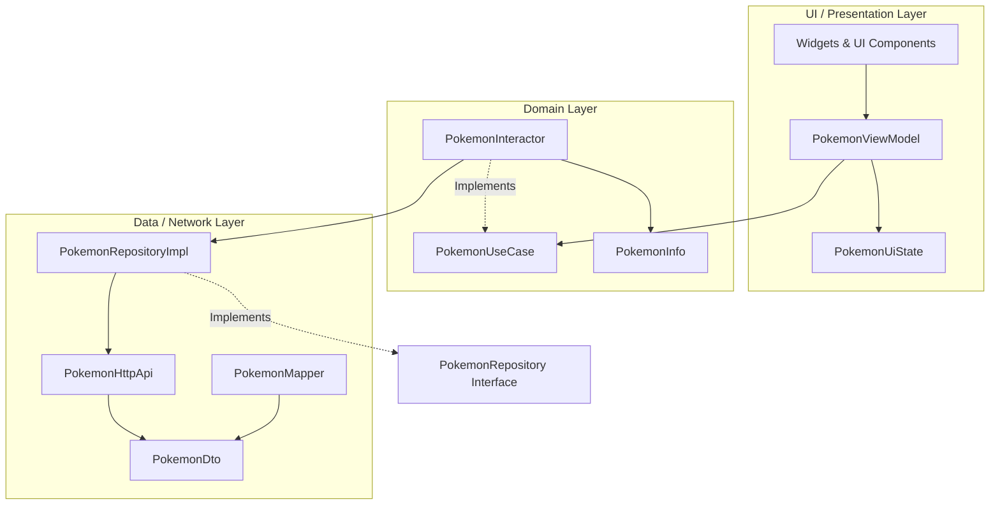

# PokeFlutter ⚡️

A Flutter Pokémon application designed to demonstrate clean architecture, robust state management, and modern design principles. 


This repository serves as the companion codebase for a series of technical articles published on Medium: **"Un cuento de dos tecnologías: Android && Flutter; la misma aplicación"** written by [Alejandro Rodríguez S. (@Al3jodroid)](https://medium.com/@al3jodroid). You can find the full list of related articles detailing this comparison and implementation in this [Medium List](https://medium.com/@al3jodroid/list/android-flutter-c7512585c5d5).


## 🏗️ Architecture Design

The project strictly follows **Clean Architecture** principles to ensure decoupling and testability:



### Layer Breakdown

1.  **Data/Network Layer:**
    *   `PokemonDto`: Defines the raw structure returned by PokeAPI.
    *   `PokemonHttpApi`: Handles GET requests using Dart's asynchronous futures.
    *   `PokemonMapper`: An extension function mapping `PokemonDto` to our pure domain model, discarding unneeded JSON properties.
    *   `PokemonRepositoryImpl`: Implements the repository interface, requesting raw DTOs and transforming them.
2.  **Domain Layer:**
    *   `PokemonUseCase` / `PokemonInteractor`: The orchestrator of business logic (e.g., generating image URLs, securing random ID generation between 1 and 151).
    *   `PokemonInfo`: The immutable model used across the UI.
3.  **Presentation / UI Layer:**
    *   `PokemonUiState`: A sealed class handling states (`Loading`, `Success`, `Error`).
    *   `PokemonViewModel`: Manages business state transitions and exposes properties.
    *   `MyHomePage`: Uses `Provider` to watch state modifications and triggers animations.

---

## ⚡ Android Developer's Cheat Sheet (Code Comparisons)

| Android Concept (Kotlin/Compose) | Flutter Equivalent (Dart/Flutter) | Project Implementation |
| :--- | :--- | :--- |
| `sealed interface UiState` | `sealed class PokemonUiState` | [pokemon_ui_state.dart](file:///Users/al3jodroid/Develop/Flutter/pokemon-flutter/pokeflutter/lib/ui/state/pokemon_ui_state.dart) |
| `Hilt / @Inject` | `MultiProvider` & `context.read<T>()` | [main.dart](file:///Users/al3jodroid/Develop/Flutter/pokemon-flutter/pokeflutter/lib/main.dart) |
| `ViewModel / LiveData / Flow` | `ChangeNotifier` & `notifyListeners()` | [pokemon_view_model.dart](file:///Users/al3jodroid/Develop/Flutter/pokemon-flutter/pokeflutter/lib/ui/home/pokemon_view_model.dart) |
| `Retrofit / OkHttp` | `http.Client` & custom parser | [pokemon_http_api.dart](file:///Users/al3jodroid/Develop/Flutter/pokemon-flutter/pokeflutter/lib/client/api/pokemon_http_api.dart) |
| `Coil AsyncImage` | `Image.network()` | [pokemon_card_widget.dart](file:///Users/al3jodroid/Develop/Flutter/pokemon-flutter/pokeflutter/lib/ui/components/pokemon_card_widget.dart) |
| `strings.xml` | `.arb` files & `AppLocalizations` | [app_es.arb](file:///Users/al3jodroid/Develop/Flutter/pokemon-flutter/pokeflutter/lib/l10n/app_es.arb) |

---

## 🚀 Getting Started

### Prerequisites

-   Flutter SDK installed (`>= 3.1.2`).
-   An emulator or a physical device connected.

### Setup and Running

1.  **Clone the repository:**
    ```bash
    git clone https://github.com/your-username/pokeflutter.git
    cd pokeflutter
    ```

2.  **Get packages:**
    ```bash
    flutter pub get
    ```

3.  **Generate Localizations:**
    The project uses Flutter's native localization tool. If localization resources are missing, run:
    ```bash
    flutter gen-l10n
    ```

4.  **Run the application:**
    ```bash
    flutter run
    ```
